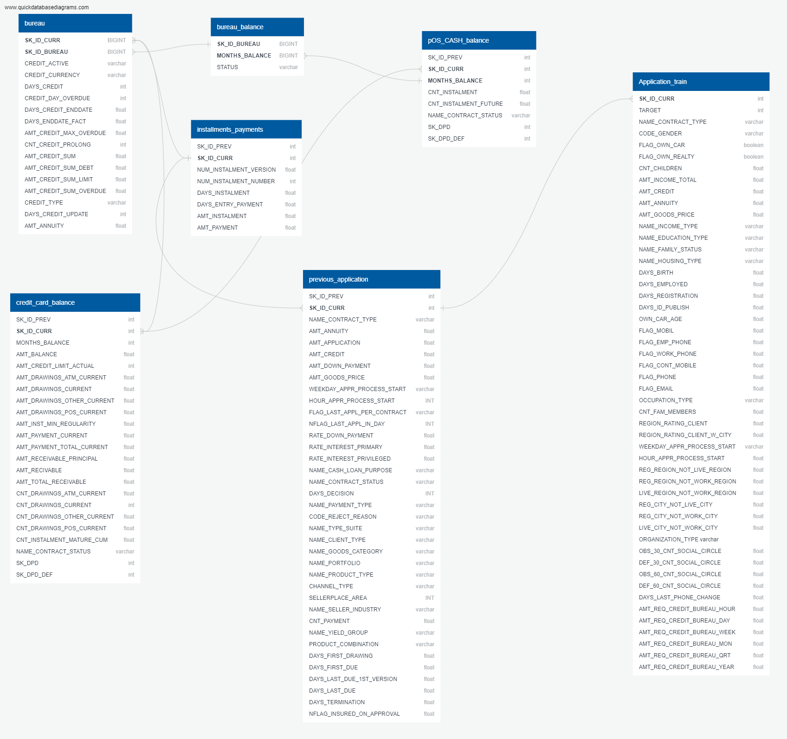
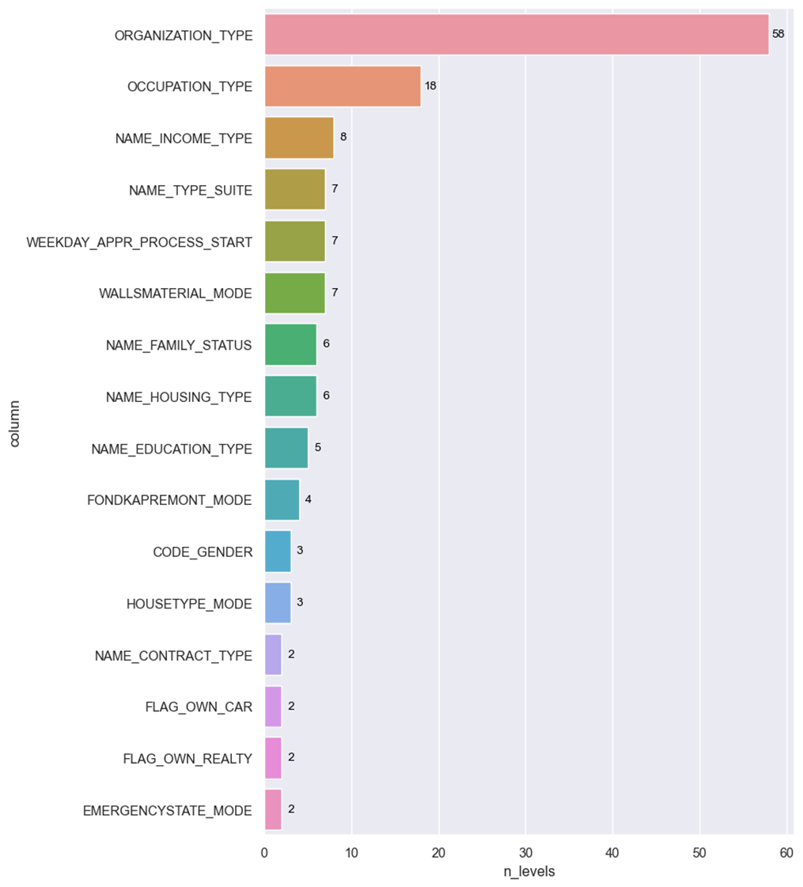
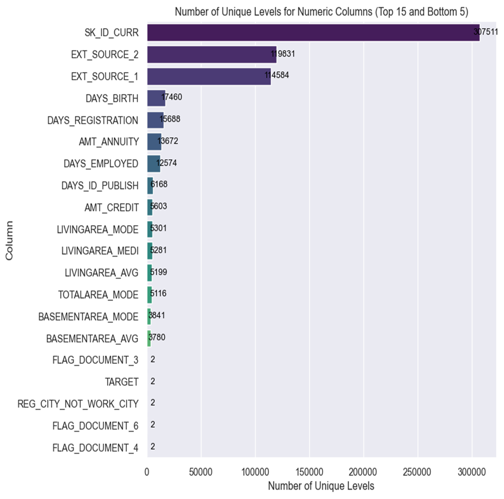
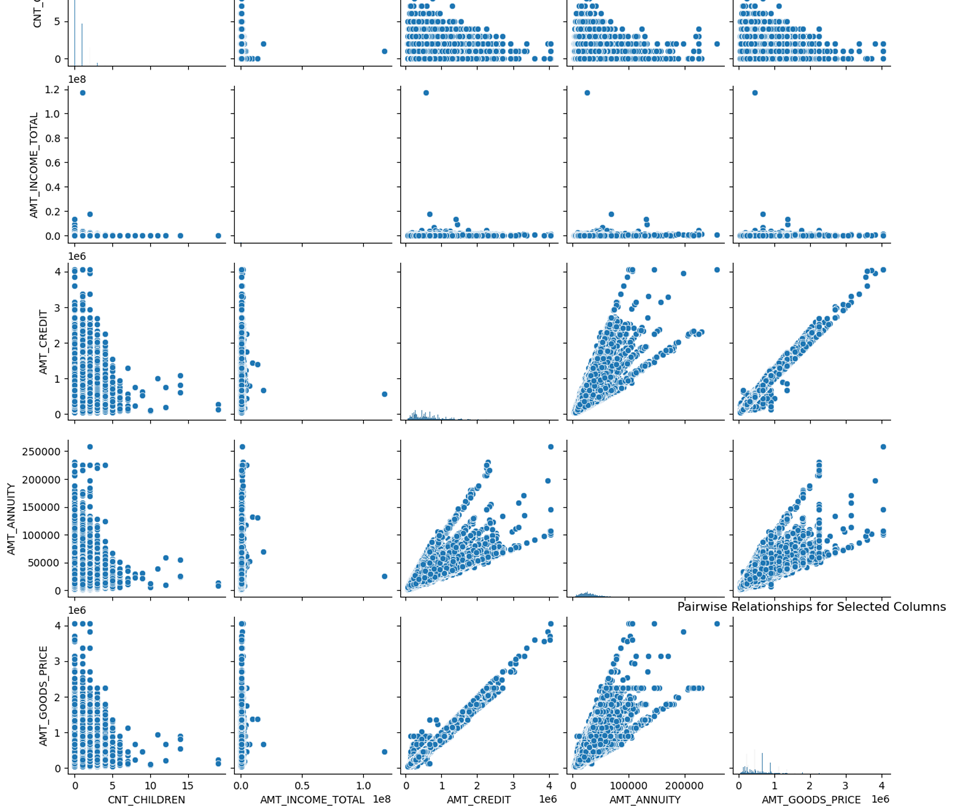
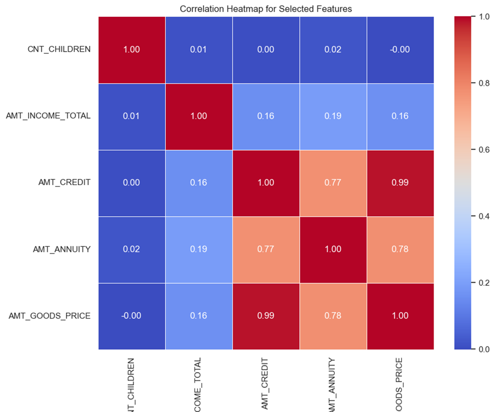
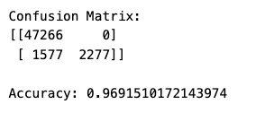
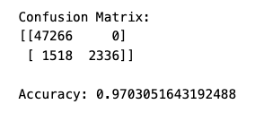
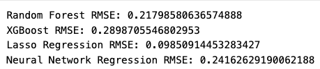

# Project-4--Group-3
Bootcamp Project 4- Project Title: Analyzing Home Credit Default Risk

# Introduction
This Project was conducted b 4 group members in the Data Analytics Bootcamp with the University of Toronto School of Continus Studies. The group members are Lovepreet Singh, Muhammad Kashif, Vinay Vattipally and Audrey Nkrumah.

# Overview
This project was aimed at building a highly accurate predictive model that can predict risk probability of default for loan applicants based on the dataset provided by the home credit. This model will be used in real life on a website. 
We started looking for data that will enable us to achieve this task and we found one on ww.Kaggle.com. The data source used for this project is: https://www.kaggle.com/c/home-credit-default-risk/data 
Once that data which met all the requirement to building this model was met, we divided the task into 4 main parts and distributed amongst group members.
### •	ETL & EDA (Extract, Transform, Load & Exploratory Data Analysis):
This part involves preparing the data for analysis and modeling by extracting it from various sources, transforming it into a suitable format, and loading it into the required data structures. Additionally, it encompasses conducting exploratory data analysis (EDA) to understand the data's properties, quality, and relationships.
### •	Data Analysis and Visualizations:
This part involves analyzing the data, exploring its characteristics, identifying patterns, trends, and relationships within the data. It also includes creating visualizations such as histograms, scatter plots, and heatmaps to gain insights into the data and communicate findings effectively.
### •	Models and Integration with Front End:
In this part, group members focus on developing machine learning models based on the analyzed data. This may include selecting appropriate algorithms, training and evaluating models, fine-tuning parameters, and integrating the models with the front end of the application or system.
### •	Front End:
Group members working on the front end are responsible for designing and developing the user interface (UI) and user experience (UX) components of the application or system. This includes creating layouts, implementing functionality, and ensuring a seamless and intuitive user interface.
Each part plays a crucial role in the overall process of building a model and its integration into a functional system or application.

# Extract, Transform and Load (ETL) 

#### Data source and acquisition process. 
Data is acquired from Kaggle.com provided by Home credit Group. 
Data contains files:
<ul>
        <li>application_{train|test}.csv</li>
        <li>bureau.csv</li>
        <li>bureau_balance.csv</li>
        <li>POS_CASH_balance.csv</li>
        <li>credit_card_balance.csv</li>
        <li>previous_application.csv</li>
        <li>installments_payments.csv</li>
        <li>HomeCredit_columns_description.csv</li>     
</ul>

### Data preprocessing steps: 
#### Handling missing values. 
- Data obtained from source has categorical data in refined form.e.g. minimal bad entries.
- However Null values in were filled by putting 0 values in columns where 0 and 1 does not impact our model predictions. since model predictions are binary which can lead to model inaccurate predictions.
 A snapshot of the result is as below indicating a successful handling of missing values 
 
  

 
#### Data cleaning and formatting. 
- After Initial cleaning and handling of missing values, CSV files are exported, a schema was created. The schema is illustrared as below:

 

#### Connect to Sources(APIs): 
- APIs are created using Database queries, Final schema file is used to create tables in Postgresql. Tables are populated with data by using postgresqlpop.ipynb file which have functions to insert data in the database from CSV files. 
The app.py file has query setup to obtain data from Postgresql via APIs.  
below is list of APIs: 
<ul>
        <li>"Bureau" : 'http://127.0.0.1:5000/bureau'</li>
       <li>"Bureau_balance" : 'http://127.0.0.1:5000/bureau_balance'</li>
        <li>"Credit_card_balance" : 'http://127.0.0.1:5000/credit_card_balance'</li>
        <li>"Installments_payments" : 'http://127.0.0.1:5000/installments_payments'</li>
       <li>"POS_CASH_balance" : 'http://127.0.0.1:5000/pOS_CASH_balance',</li>
       <li> "Previous_application" : 'http://127.0.0.1:5000/previous_application'</li>
        <li>"Application_train" : 'http://127.0.0.1:5000/application_train'</li>
</ul>

#### Data Retrieval from APIs: 
- Data is extracted from API and tables are merged together using model_probab.ipynb & model_predict.ipynb file for respective modelling purpose.
-"POS_CASH_balance", "Installments_payments", "Credit_card_balance", "Previous_application" were merged on SK_ID_PREV and then the "Application_train" & "Bureau" on SK_ID_CURR while Bureau is attached with Bureau_balance at SK_ID_bureau.
- Data is then used for modelling process and Data analysis.

# Exploratory Data Analysis (EDA).

### Categorical Features Analysis Summary
The categorical Features were examined, and the unique number of levels was obtained.
Upon analyzing the categorical features in the dataset, several key observations were made summarizig it in the graph below:

A snapshot of the numerical features analysis is also depicted as below:

Correlational Analysis of some featues and its heatmap created to show relationship amongst variables

# Models and Integration with Front End  
### Model Selection:
Since our data is skewed, it has count of 176770 for 0  and 14780 for 1. 
While trying of choose a reasonable model, resampling and ensembling methods were used. 
RandomOverSampler and SMOTE were used to balance the data. 
Models' predictions were made and imbalanced classification reports were gathered.
Based on the classification reports a concise heatmap is generated.

 

RandomForestClassifier Model has been found to be best model for the purpose with high accuracy and better precision, Recall and F1 scores. model was tested with balanced data as well but the results were found to be pretty much same.
AdaBoost when used with balanced data using SMOTE showed terrible decline in precision for high risk prediction.
Similary for prediction of RandomForestRegressor model RMSE of found to be second best after Lasso Regression. Since Lasso Regression is better suited for feature selection than prediction with weak relationship.So RandomForestRegressor model is selected. 

### 1. Model accuracy & probability. The following steps were taken to build a machine learning model
- Splitting the dataset into training and testing sets.
- Selection of appropriate machine learning algorithms: Random Forest Classifier. 
- Model training and evaluation.
- Performance metrics (accuracy, precision, recall, F1-score, etc.).

- Hyperparameter tuning.
- Choosing top contributing features in model and testing model accuracy again.

### 2. Model prediction
- Splitting the dataset into training and testing sets.
- Selection of appropriate machine learning algorithms: Random Forest Regressor, XG Boost, Lasso Regression and Neural Network Regression.
- Model training and evaluation.
- Performance metrics (accuracy, precision, recall, F1-score, etc.).

- Hyperparameter tuning.

#### Website Building

 

# Results and Discussion
- Presentation of the model evaluation results.
- Interpretation of feature importance.
- Discussion on the model's performance and limitations.
- Insights derived from the analysis.

# Conclusion
- Summary of key findings.
- Recommendations for future work.
- Conclusion remarks.

# References
- Citation of datasets, libraries, and resources used.
Data Source: https://www.kaggle.com/c/home-credit-default-risk/data
# Appendix
- Additional charts or tables.
- Any other supplementary materials.

